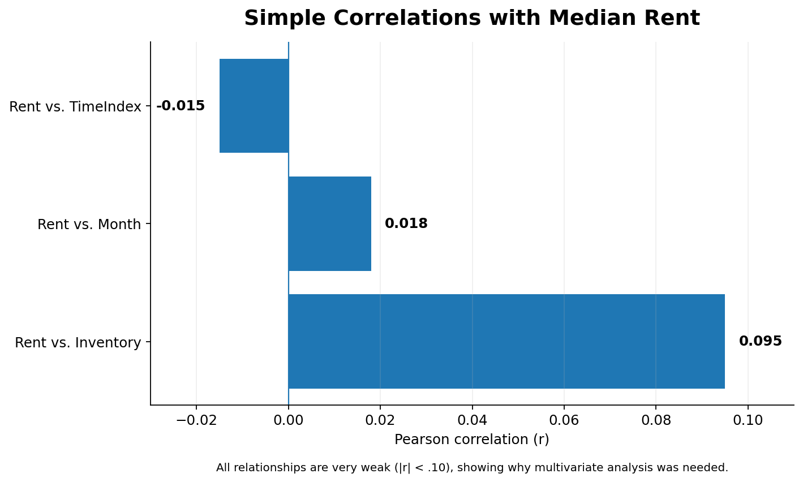
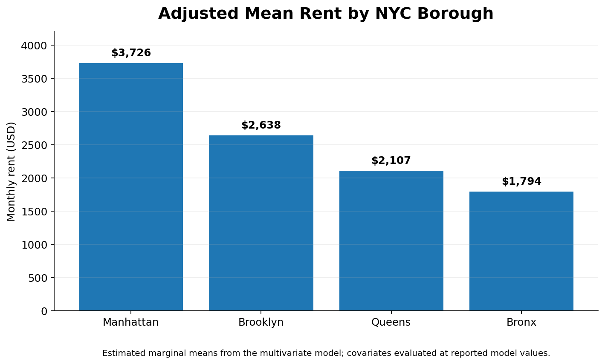
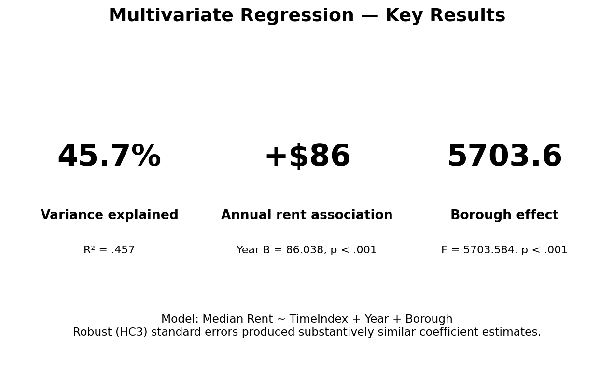

# NYC Rent Market Analysis

## Structural Drivers of Rental Prices Across New York City

This project analyzes how **geography and time are associated with rental price variation across New York City**, using Median Asking Rent as the primary measure of rental market conditions.

Using **24,477 observations from 2010–2025**, the analysis combines exploratory data analysis, correlation analysis, and multivariate regression to examine how rental prices vary across boroughs and over time.

---

## 🎯 Project Objective

The objective of this project was to examine the contribution of geographic and temporal factors to NYC rental price variation.

The analysis followed four stages:

1. Data Preparation
2. Exploratory Data Analysis
3. Regression Modeling
4. Business Interpretation

---

## 📊 Dataset

The analysis combines NYC rental market data covering the period from **2010 to 2025**.

Key variables include:

- Median Asking Rent
- Rental Inventory
- Borough
- Neighborhood / Area Type
- Month
- Year
- Time Index

The final analytical dataset contained **24,477 observations** with no missing values in the categorical variables examined.

---

## 🛠 Tools & Methods

**Tools**

- SPSS
- Excel

**Methods**

- Data Cleaning & Preparation
- Descriptive Statistics
- Exploratory Data Analysis
- Correlation Analysis
- Scatter Plot Analysis
- Multivariate Regression
- Geographic Comparison

---

## 🔎 Exploratory Analysis

Median asking rents showed substantial variation across NYC, ranging from approximately **$763 to $13,287** in the dataset.

The borough-level descriptive analysis showed clear geographic differences in rental prices:

- Manhattan had the highest average rents
- Brooklyn and Queens occupied the middle range
- The Bronx had substantially lower rents
- Staten Island represented a relatively small share of the observations

Simple correlations between rent, inventory, time, and month were generally very weak, with correlation coefficients below **0.10**.

This suggested that simple bivariate relationships were insufficient to explain NYC rental price behavior and motivated the use of multivariate analysis.

---

## 📈 Key Findings

### NYC Rental Market at a Glance

### Geography Matters

The analysis identified substantial differences in adjusted rental levels across boroughs.

Selected adjusted mean rents were approximately:

| Borough | Adjusted Mean Rent |
|---|---:|
| Manhattan | $3,726 |
| Brooklyn | $2,638 |
| Queens | $2,107 |
| Bronx | $1,794 |

The adjusted difference between Manhattan and the Bronx was approximately **$1,932 per month**, while the difference between Brooklyn and Queens was approximately **$531 per month**.

These results indicate that geographic location is strongly associated with rental price differences after accounting for variables included in the model.

### Long-Term Rent Growth

The model estimated that NYC rent increased by approximately **$86 per year on average** over the period examined.

### Multivariate Analysis Adds Explanatory Power

Although simple correlations between rent and individual variables such as month or inventory were weak, the multivariate model explained **nearly half of the observed variation in rent**.

This suggests that NYC rental prices are better understood through a combination of geographic and temporal factors rather than through any single variable.

---

## 💡 Business Interpretation

The analysis highlights three practical insights:

**1. Location is a major source of rental price variation.**  
Large differences across boroughs suggest that NYC should not be treated as a single homogeneous rental market.

**2. Long-term trends matter more than short-term calendar effects.**  
The estimated annual increase in rent suggests a meaningful long-term time component, while month-level relationships were comparatively weak.

**3. Statistical significance should be interpreted together with effect size.**  
With a large dataset, some relationships can be statistically significant even when their practical magnitude is small.

These findings may be useful for analysts, renters, policymakers, and other stakeholders examining housing affordability and geographic differences across New York City.

---

## ⚠️ Interpretation & Limitations

The results identify **statistical associations rather than causal effects**.

Rental prices may also be influenced by factors not fully captured in the model, including property characteristics, neighborhood amenities, macroeconomic conditions, housing policy, and other supply-and-demand dynamics.

The findings should therefore be interpreted as evidence of structural patterns within the analyzed dataset rather than proof that geography or time alone causes changes in rental prices.

---

## 👥 Project Context

**Team Project — Quantitative Methods for Business Analysis**

This project was completed as part of a four-person team project.

The analysis involved collaborative work across data preparation, exploratory analysis, statistical modeling, interpretation, and presentation development.

---

## 💼 Skills Demonstrated

`Business Analytics` `Statistical Analysis` `Regression Analysis` `SPSS` `Excel` `Exploratory Data Analysis` `Data Visualization` `Market Analysis` `Business Interpretation`

---

## 📄 Project Presentation

## 📄 Full Analysis Report

The full report includes detailed data preparation, exploratory analysis, regression results, statistical diagnostics, and interpretation.

🔗 [View Full Analysis Report](report/NYC_Rent_Market_Analysis_Report.pdf)
